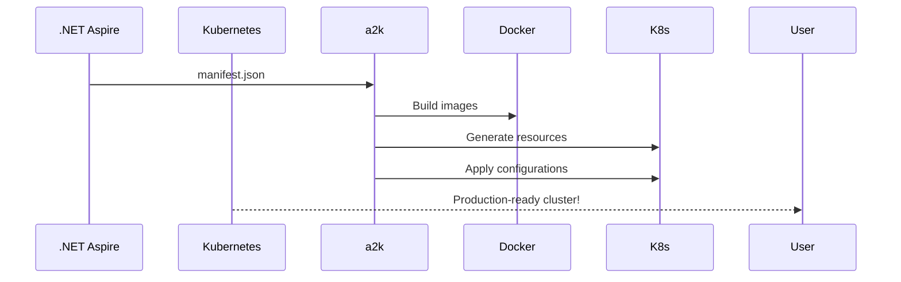
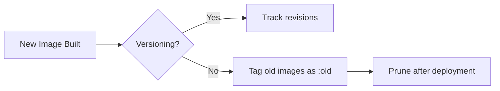

# a2k

### Basic Usage
```bash
a2k --appHostPath ./AppHost --name myapp --env production
```

## 📋 Typical Workflow


## 🛠 Configuration Options

| Parameter         | Description                          | Default           |
|-------------------|--------------------------------------|-------------------|
| `--appHostPath`   | Path to Aspire AppHost project       | Current Directory |
| `--name`          | Kubernetes namespace name           | Solution name     |
| `--env`           | Deployment environment               | "default"         |
| `--useVersioning` | Enable revision tracking             | false             |

## 🧩 Supported Resources

| Aspire Resource   | Kubernetes Equivalent        |
|-------------------|------------------------------|
| Projects          | Deployments + Services       |
| Containers        | Deployments + Services       |
| Parameters        | ConfigMaps/Secrets           |
| Values            | ConfigMaps/Secrets           |
| Bindings          | Services + Ingress Rules     |

## 🧹 Image Cleanup Strategy


## 💻 Development

### Build from Source
```bash
git clone https://github.com/mithgroth/a2k.git
cd a2k
dotnet build
```

### Running Tests
```bash
dotnet test
```

## 📄 License

MIT License - See [LICENSE](LICENSE) for details.

---

Made with ❤️ by [Emek Taydaş] | Powered by .NET Aspire & Kubernetes