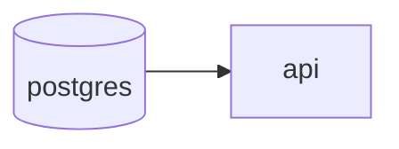
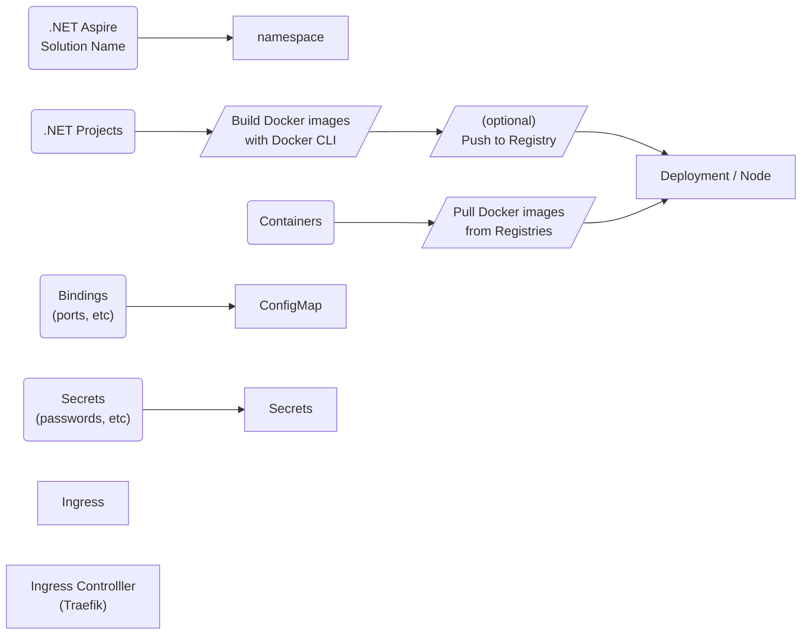

## Short story of a2k - Aspire to Kubernetes
_TLDR: .NET Aspire team already started building what a2k intended to do (deploying .NET Aspire to Kubernetes clusters), so just letting them cook._

### Background
I'm one of the early adapters of [.NET Aspire](https://github.com/dotnet/aspire).
When it first came out, I loved the idea of adding a database with `.AddPostgres()`, it was Terraform on steroids. [Isn't that cool?](https://www.reddit.com/r/dotnet/comments/1i5ux36/comment/m87a0tt/?utm_source=share&utm_medium=web3x&utm_name=web3xcss&utm_term=1&utm_content=share_button)

In time, it only got better and better, becoming more of a platform. As 2024, its main focus was local development, and it could deliver that "_hitting F5_" moment - and it continues down that path in 2025 too. Instead of running batch scripts, setting up environments and configuration, .NET Aspire aims to reduce that to a `git clone` and `F5`. Sounded like a dream a few years ago.

Local development was fine, but what about staging, production? Well, there is support for `azd`, but that's actually it. But wait, what is this `manifest.json` is doing here?

 >.NET Aspire manifest format for deployment tool builders

At the time I discovered tooling support, I also discovered [Aspirate](https://github.com/prom3theu5/aspirational-manifests). Super cool project with super cool author, I decided to give it a spin. It can generate Helm charts for Kubernetes deployments, fantastic! Maybe this is what I was looking for?

Yes... and no.

### Problems with Aspirate
#### Built off of `manifest.json`
It turns out there are details that are not written to `manifest.json`. You can define how you like your environment to be, your resources and everything, but don't expect all the annotations to be in `manifest.json`. So you have to give up some functionality.
#### Cannot `.WaitFor()`
There are so many cool things you can do in .NET Aspire, `.WaitFor()` is one of my favourites. Consider having a database and an API depending on it.

You'd spin up the database, get your `/healthcheck` positive, then you'd start your API, so it wouldn't complain about not being able to connect to a non-existing database. This was a dealbreaker in my case.

```csharp
var databaseServer = builder.AddPostgres("postgres").WithDockerfile(@"data");
var database = databaseServer.AddDatabase("db");

var api = builder.AddProject<Projects.Api>(nameof(Projects.Api).ToLower())
    .WithExternalHttpEndpoints()
    .WithReference(database)
    .WaitFor(database);
```

As I was spinning my custom docker image with seeded initial data, I had first had to get my database up, and I could do that in local environment with .NET Aspire, but I **couldn't** deploy it without manual intervention to a Kubernetes cluster.

Aspirate's Helm charts were missing this information as well, since they were not reflected to `manifest.json`.

### OK, time to build
So a month ago (Jan '25), I decided to build it myself, firstly started as a CLI tool, inspired by Aspirate.

First I tried to brute force it - maybe I could read the missing annotations? Maybe from AppHost? Maybe a helper library, so it would extend `manifest.json` and add what I'm missing?

These were initial ideas, all of them proved to be more difficult than it should be. Then I just went ahead and start building a2k as a CLI and it worked great!

Now I had the CLI [at this point](https://github.com/Mithgroth/a2k/tree/7736cb93a81ffe758c9d655f948d352929473bde), I could build to local and remote Kubernetes clusters and my initial tests were looking up. 

This was a2k's initial mapping:



This was a good enough starting point, but what if there was a better way?
Turns out [there was](https://github.com/aws/integrations-on-dotnet-aspire-for-aws). AWS released their Aspire integration, and it is a fantastic one. They leveraged lifecycle hooks for provisioning cloud resources, and their approach was much more native and embedded to .NET Aspire workflow. No external tool installations were needed as well!

Aspirate had no updates for 6 months, so it was time to go. If we could deploy this easily to any Kubernetes cluster, I could just start using Aspire end-to-end.

### Well...
I completely transformed and opted-out of CLI in a night, it was already promising, development was fun. Aspire codebase is huge, so catching up takes time.

It took me a while till I figured out about DCP. Anthony Simmon definitely noticed that a year before me, and wrote [a blogpost](https://anthonysimmon.com/exploring-microsoft-developer-control-plane-core-dotnet-aspire-dotnet-8/). Developer Control Plane seems to be the magic which .NET Aspire interacts with to build Docker images. In my CLI version, I was handling these by calling Docker process with arguments, it was time I moved that logic.

Well... Then... I did a `git pull` and seen **the** commit [5633dc4](https://github.com/dotnet/aspire/commit/5633dc4b92359df2076c1e332a308edae2e40bed).

`ApplicationExecutor`, a wrapper around DCP was renamed `DcpExecutor` and it had the line:

```csharp
    private readonly IKubernetesService _kubernetesService;
```

 Watching [David Fowler's interview with Nick Chapsas](https://www.youtube.com/watch?v=FPwAGfslTJM) today (_it's brilliant to watch, highly recommend_), it made me click. Nick drops the deployment to production question early on, something highly anticipated and apparently people have been asking about it a lot. David Fowler is asked about Kubernetes directly around [21:11](https://youtu.be/FPwAGfslTJM?t=1271):

 > I'm trying to figure out how we take what we've learned from Aspirate, azd and how that moves forward in the future. We definitely -and I have prototypes of all this this stuff- so like we definitely want to support Kubernetes in a first class way. It's just, those are the easy... just makes sense to build, right? How that gets packaged, how we make it work is not fully clear yet, but it is, to me, I think I understand now doing a bunch of research...

 And we already have the early commits of this. I believe we are getting it soon.
Sad for me and what I built so far, but I'll move on building something else, and eventually .NET Aspire will even become cooler.

Till next time!